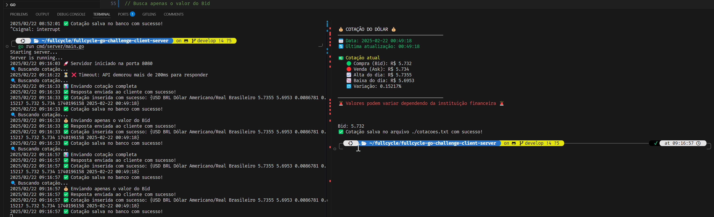

# 📌 Projeto: Cotação do Dólar

Este projeto implementa um servidor e um cliente para obter a cotação do dólar e armazenar os dados utilizando **Go**, **SQLite** e **contextos para controle de timeout**.

## 📂 Estrutura do Projeto

```
.
├── README.md            # 📌 Documentação principal do projeto
├── docs/                # 📂 Documentação detalhada
│   ├── API.md           # 📌 Documentação da API
│   ├── DATABASE.md      # 📌 Estrutura do banco de dados
│   ├── DEPLOY.md        # 📌 Guia de deploy
│   ├── ARCHITECTURE.md  # 📌 Arquitetura do sistema
│   └── assets/          # 📂 Diagramas e imagens
├── cmd/                 # 📂 Entrypoints do projeto (client/server)
│   ├── client/main.go   # 📌 Código principal do cliente
│   └── server/main.go   # 📌 Código principal do servidor
├── internal/            # 📂 Código interno do projeto
│   ├── auth/            # 📌 Autenticação (se necessário)
│   ├── client/          # 📌 Lógica do cliente
│   ├── config/          # 📌 Configurações do projeto
│   ├── database/        # 📌 Conexão com o banco de dados
│   └── server/          # 📌 Lógica do servidor
├── pkg/                 # 📂 Pacotes reutilizáveis
│   ├── api/             # 📌 Definições de API
│   ├── models/          # 📌 Estruturas de dados
│   └── utils/           # 📌 Utilitários gerais
├── deploy/              # 📂 Configurações de deployment
├── scripts/             # 📂 Scripts auxiliares
└── web/                 # 📂 Interface web (se aplicável)
```

## 🚀 Como Executar o Projeto

### 🔹 **1. Iniciar o Servidor**
```sh
go run cmd/server/main.go
```

### 🔹 **2. Iniciar o Cliente**
```sh
go run cmd/client/main.go
```

## 📖 Documentação
- 📌 **[API.md](docs/API.md)** → Documentação dos endpoints.
- 📌 **[DATABASE.md](docs/DATABASE.md)** → Estrutura do banco de dados.
- 📌 **[ARCHITECTURE.md](docs/ARCHITECTURE.md)** → Arquitetura do sistema.
- 📌 **[DEPLOY.md](docs/DEPLOY.md)** → Guia de deploy.

## 🛠️ Tecnologias Utilizadas
- **Go (Golang)**
- **SQLite**
- **net/http**
- **context (para timeouts)**
- **cURL para testes**

## 🔄 Fluxo do Sistema

1️⃣ **Cliente (`client.go`)** solicita a cotação do dólar ao servidor.

2️⃣ **Servidor (`server.go`)** busca a cotação da API externa e armazena no banco SQLite.

3️⃣ **Servidor responde ao cliente** com o valor do **bid**.

4️⃣ **Cliente salva o valor da cotação** no arquivo `cotacoes.txt`.


## 📸 Exemplo de Saída do Programa

Aqui está a saída gerada pelo programa:



## 📌 Considerações
✅ **Timeouts configurados** para evitar travamentos.

✅ **Banco de dados otimizado** para armazenar cotações recentes.

✅ **Código modularizado** para facilitar manutenção.

---

🚀 **Codado por Willams "osdeving" Sousa** em 22/02/2025 🚀

