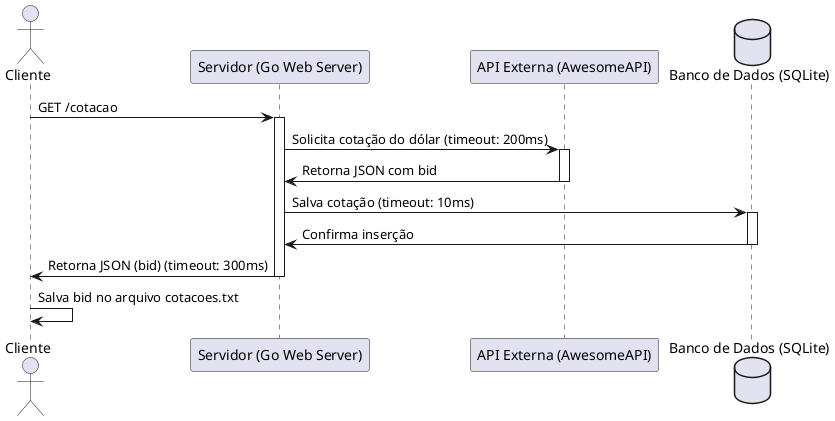
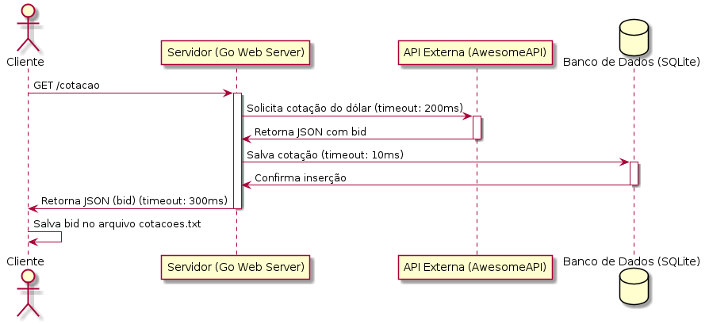
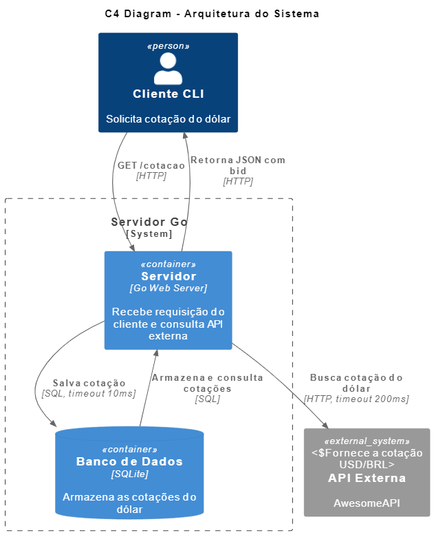

# 📌 Arquitetura do Projeto

Este documento descreve a arquitetura do projeto, incluindo sua estrutura de diretórios, fluxos de dados e principais tecnologias utilizadas.

## 📂 Estrutura de Diretórios

```
.
├── README.md            # 📌 Documentação principal do projeto
├── docs/                # 📂 Documentação detalhada
│   ├── API.md           # 📌 Documentação da API
│   ├── DATABASE.md      # 📌 Estrutura do banco de dados
│   ├── DEPLOY.md        # 📌 Guia de deploy
│   ├── ARCHITECTURE.md  # 📌 Arquitetura do sistema
│   └── assets/          # 📂 Diagramas e imagens
├── cmd/                 # 📂 Entrypoints do projeto (client/server)
│   ├── client/main.go   # 📌 Código principal do cliente
│   └── server/main.go   # 📌 Código principal do servidor
├── internal/            # 📂 Código interno do projeto
│   ├── auth/            # 📌 Autenticação (se necessário)
│   ├── client/          # 📌 Lógica do cliente
│   ├── config/          # 📌 Configurações do projeto
│   ├── database/        # 📌 Conexão com o banco de dados
│   └── server/          # 📌 Lógica do servidor
├── pkg/                 # 📂 Pacotes reutilizáveis
│   ├── api/             # 📌 Definições de API
│   ├── models/          # 📌 Estruturas de dados
│   └── utils/           # 📌 Utilitários gerais
├── deploy/              # 📂 Configurações de deployment
├── scripts/             # 📂 Scripts auxiliares
└── web/                 # 📂 Interface web (se aplicável)
```

## 🛠️ Tecnologias Utilizadas
- **Linguagem:** Go (Golang)
- **Banco de Dados:** SQLite
- **Web Server:** `net/http`
- **Autenticação:** (Se necessário, pode ser JWT ou OAuth)
- **Contexto:** `context` para controle de timeout

## 🔄 Fluxo de Dados
1️⃣ **Cliente (`client.go`)** faz uma requisição `GET /cotacao` para o servidor.
2️⃣ **Servidor (`server.go`)** busca a cotação na API `https://economia.awesomeapi.com.br/json/last/USD-BRL` (timeout de `200ms`).
3️⃣ **Servidor armazena no banco** de dados SQLite (timeout de `10ms`).
4️⃣ **Servidor responde ao cliente** com a cotação (`bid`) em JSON.
5️⃣ **Cliente salva a cotação** no arquivo `cotacoes.txt`.

## 📌 Diagramas
## 📌 Diagrama de Sequência

O diagrama abaixo representa o fluxo de comunicação entre os componentes do sistema.






### **Diagrama de Componentes**




## 🚀 Conclusão
Esta arquitetura garante:
✅ **Baixa latência** com timeouts configurados.
✅ **Persistência dos dados** via SQLite.
✅ **Facilidade de manutenção** com estrutura modularizada.

🚀 **Agora sua arquitetura está bem definida e documentada!**
